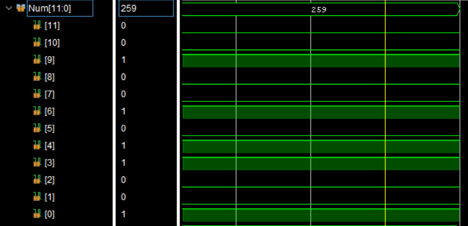
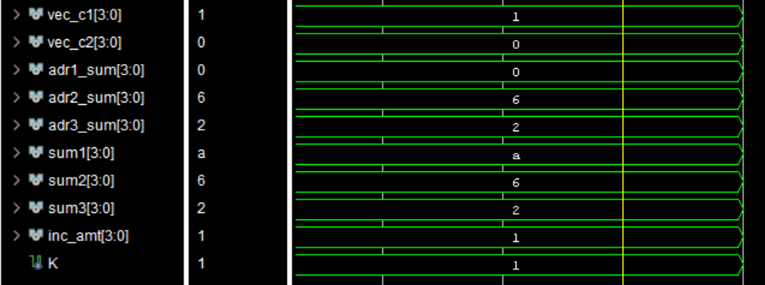
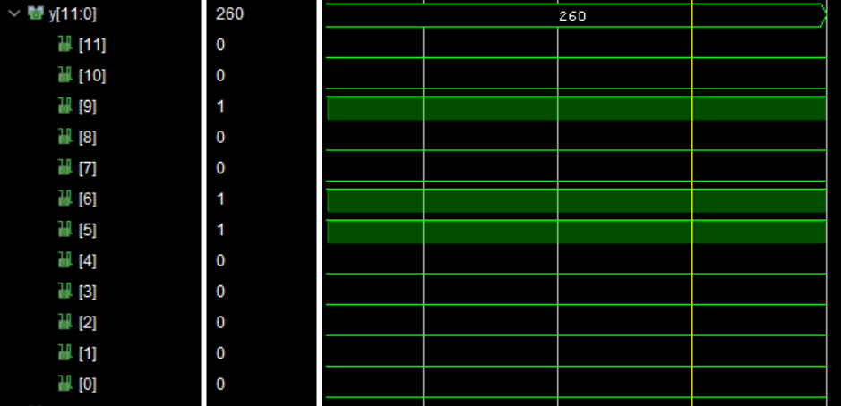

## VHDL Design for Binary-Coded Decimal Incremnetor
Increments a BCD number by 1.
### Behavioral Simulation Results
- Input: 12-bit 'Num' representing 3 Base-10 digits encoded by 4-bit binary numbers

- N-Bit Adder Circuit Signals

- Output: 12-bit 'y' representing input + 1

