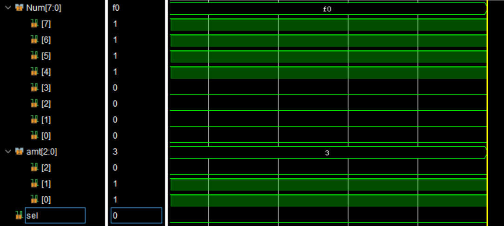
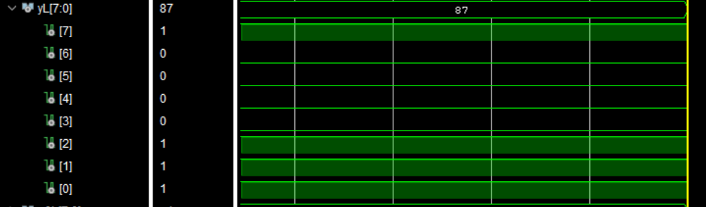
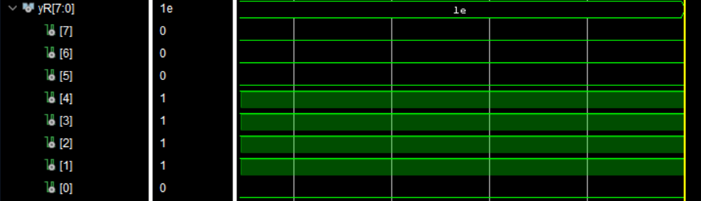
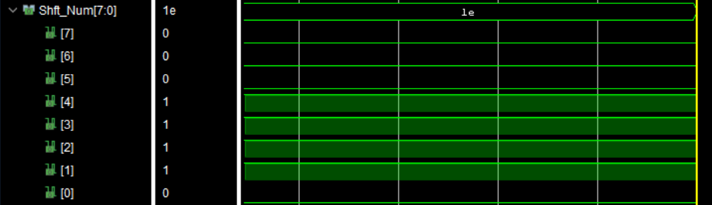

## VHDL Design for a Barrel Shifter
### Behavioral Simulation Results
- 8-bit Input Signal: Num & 2-bit Input Rotation: amt

- Left Shited Input

- Right Shifted Input

- 8-bit Output Signal based on MUX selection: Right(0) or left(1)

