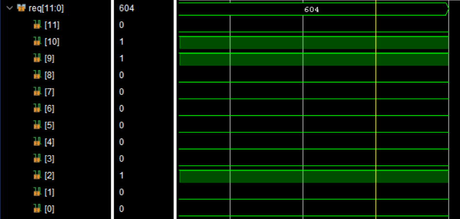
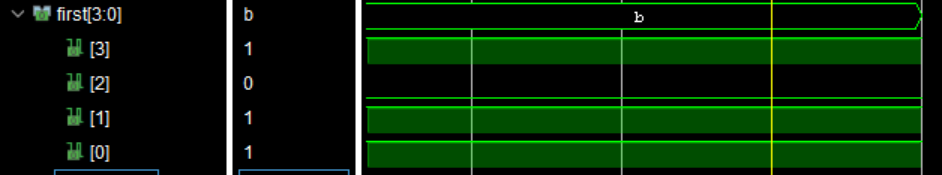
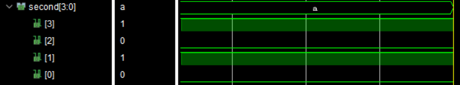

## VHDL Design for a Dual Priority Encoder.
Just like a Priority Encoder, this design outputs the encoded position of the MSB '1' and in addition also outputs the position of the second MSB '1'.
### Behavioral Simulation Results
- Input Signal: 12-bit 'req' signal

- Output: First Priority Encoding: 4-bit 'first' signal

- Output: Second Priority Encoding: 4-Bit 'second' signal

